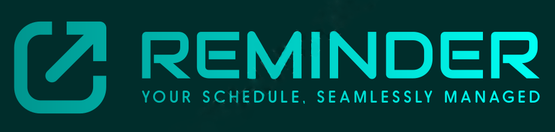

<div align="center">



<!-- Badges -->
<p>


</p>

<h4>
  <span> · </span>
    <a href="https://github.com/Petrovich-A/Reminder/tree/develop/src/main/resources/doc">Documentation</a>
  <span> · </span>
</h4>
</div>

<br />

<!-- Table of Contents -->

# :notebook_with_decorative_cover: Table of Contents

- [About the Project](#star2-about-the-project)
    * [Tech Stack](#space_invader-tech-stack)
- [Getting Started](#toolbox-getting-started)
    * [Run Locally](#running-run-locally)
    * [Run with Docker](#docker)
- [Contact](#handshake-contact)
- [Acknowledgements](#gem-acknowledgements)

<!-- About the Project -->

## :star2: About the Project

### Reminder Application

The Reminder application is a Java-based backend REST API designed to manage reminders for users. It provides functionalities to create, delete, edit, search, sort, and filter reminders. The application includes features for sending notifications via email and Telegram when reminders are due.

You can find the API documentation [here](https://github.com/Petrovich-A/Reminder/blob/main/src/main/resources/static/openapi.yaml).


### Key Features
- **User Authentication**: Secure user login with OAuth2.
- **Reminder Management**: Create, update, delete, and search reminders.
- **Sorting and Filtering**: Sort and filter reminders by various criteria.
- **Pagination**: Paginated list of reminders.
- **Notification System**: Send notifications via email and Telegram.

### Testing
The application code is covered by comprehensive unit and integration tests to ensure reliability and robustness. All major functionalities, including API endpoints and business logic, are tested to maintain high quality.

### Non-Functional Requirements
- **Unit and Integration Testing**: Comprehensive testing for all API endpoints and functionalities.
- **Docker Integration**: Containerized deployment with Docker and Docker Compose.

<!-- TechStack -->

### :space_invader: Tech Stack

<details>
  <summary>Tech Stack</summary>
  <ul>
    <li>
      <a href="https://spring.io/projects/spring-boot">
        
      </a>
    </li>
    <li>
      <a href="https://www.postgresql.org/">
        
      </a>
    </li>
    <li>
      <a href="https://www.liquibase.org/">
        
      </a>
    </li>
    <li>
      <a href="https://hibernate.org/">
        
      </a>
    </li>
    <li>
      <a href="https://spring.io/projects/spring-security">
        
      </a>
    </li>
    <li>
      <a href="https://docs.gradle.org/">
        
      </a>
    </li>
    <li>
      <a href="https://www.quartz-scheduler.org/">
        
      </a>
    </li>
    <li>
      <a href="https://www.testcontainers.org/">
        
      </a>
    </li>
    <li>
      <a href="https://docs.docker.com/">
        
      </a>
    </li>
  </ul>
</details>

<!-- Getting Started -->

## :toolbox: Getting Started

### :running: Run Locally

1. Clone the project:
    ```bash
    git clone https://github.com/Petrovich-A/Reminder.git
    cd reminder-app
    ```

2. Configure the application:
    - Create a `.env` file in the root directory with the following environment variables:
      ```env
      DATASOURCE_USERNAME=your_db_username
      DATASOURCE_PASSWORD=your_db_password
      MAIL_USERNAME=your_email_username
      MAIL_PASSWORD=your_email_password
      TELEGRAM_BOT_TOKEN=your_telegram_bot_token
      ```

3. Build and run the application:
    ```bash
    ./gradlew build
    ./gradlew bootRun
    ```

4. Access the API at `http://localhost:8080`.

### :whale: Docker

1. **Build the Docker image**:
    ```bash
    docker-compose build
    ```

2. **Run the Docker containers**:
    ```bash
    docker-compose up
    ```

3. The application will be available at `http://localhost:7000`.

<!-- Contact -->

## :handshake: Contact

Petrovich Alexandr - [@Petrovich Alexandr](https://www.linkedin.com/in/alexandr-petrovich/) - a.piatrovich@gmail.com

<!-- Acknowledgements -->

## :gem: Acknowledgements

- [Spring Boot Documentation](https://spring.io/projects/spring-boot)
- [PostgreSQL Documentation](https://www.postgresql.org/docs/)
- [Liquibase Documentation](https://docs.liquibase.com/)
- [Hibernate Documentation](https://hibernate.org/orm/documentation/)
- [Spring Security OAuth2 Documentation](https://spring.io/projects/spring-security)
- [Quartz Documentation](https://www.quartz-scheduler.org/documentation/)
- [Docker Documentation](https://docs.docker.com/)
